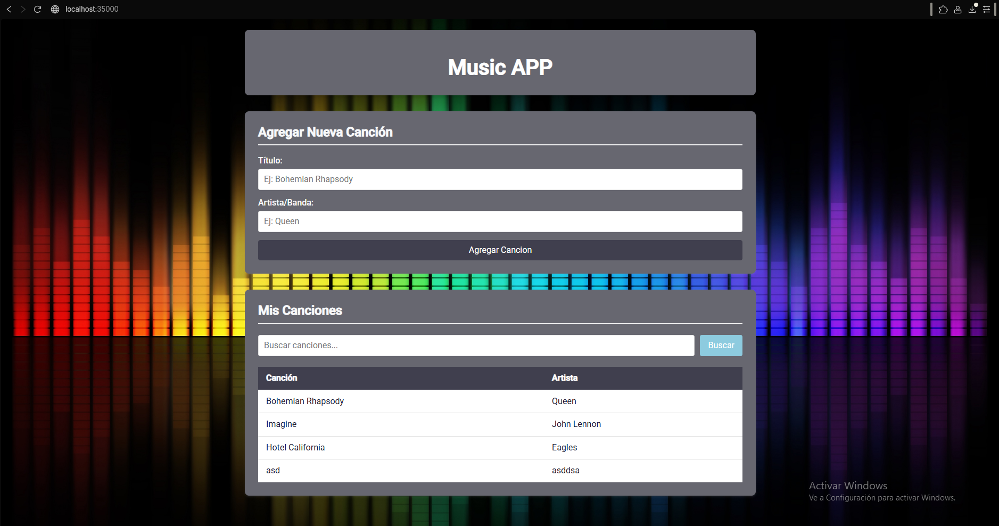
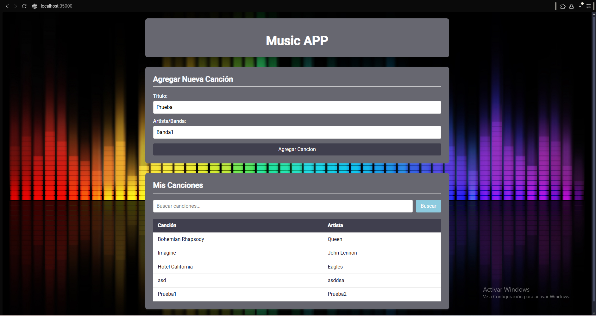
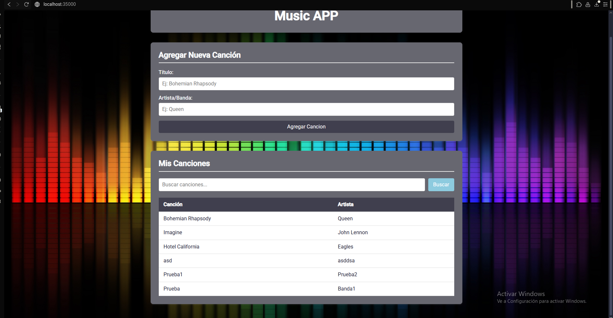
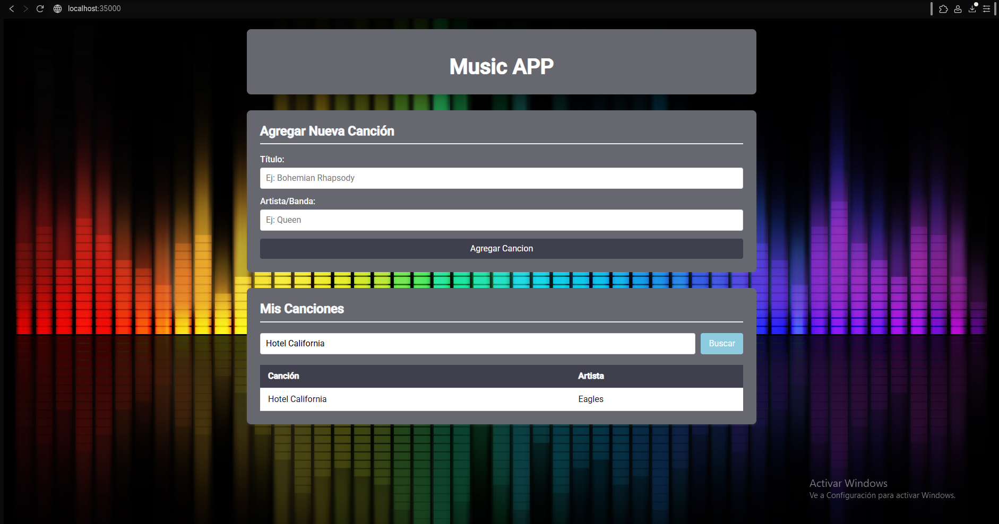
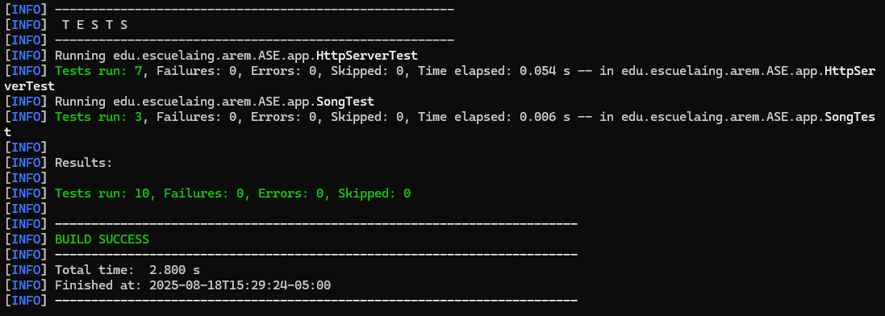

# Lab01 diseño y estructuración de aplicaciones distribuidas en internet

En este laboratorio se desarrollo un servidor Http con el fin de poder realizar multiples solicitudes, para lograrlo 
se utilizo javascript, css, java y librerias que nos permitan realizar el manejo de la red, mas no se utilizaron frameworks
como Spark o Spring.

Se realizo el servidor Http para poder realizar un lista de musica, es decir poder manejar tu propia lista de musica.

## Screenshots of the project in action

Inicio de la pagina.



Vamos a añadir una canción a la lista.



Vemos que se añadio correctamente la canción a la lista de canciones.



Vemos que la función de buscar canciones funciona de manera correcta.



## Getting Started

Lo siguiente que se apreciara son los prerrequisitos para poder correr el proyecto de manera correcta.

### Prerequisites

Los prerrequisitos para poder instalar el proyecto son los siguientes:

```
- Maven
- Cualquier navegador Web
- Java 17+
```
### Installing

A continuación se va a ver el paso a paso para la instalación del proyecto.

1. Clonar el repositorio

```
git clone https://github.com/Santiago-Cordoba/Lab01-AREP-Taller-Dise-o-y-estructuraci-n-aplicaciones-distribuidas-de-internet.git
```

2. Compilar el proyecto con maven (requisito previamente escrito)

```
mvn package
```

3. Desde un IDE ejecutar la clase HttpServer

4. Una vez se esté ejecutando de manera correcta la clase HttpServer, en el navegador colocaremos:

```
http://localhost:35000
```

## Running the tests

Se corren los test los diferentes funciones que se programaron para probar el correcto funcionamiento del proyecto.



### Break down into end to end tests

Explain what these tests test and why

```
Give an example
```

### Architecture

Para Frontend se utilizo:

```
- JavaScript
- HTML
- CSS
```

Para backend se utilizo:

```
- Librerias para el manejo de la red (manejo de las peticiones HTTP).
- Librerias para poder realizar las conexiones con los Sockets
```

## Built With

* [Java](https://www.java.com/es) - Lenguaje para el backend
* [Maven](https://maven.apache.org/) - Manejo de Dependencias

## Authors

* **Santiago Córdoba Dueñas**  - [Santiago Córdoba](https://github.com/Santiago-Cordoba)

## Acknowledgments

* Conocimiento de como montar un server Http sin la necesidad de usar frameworks como Spring
* Entendimiento del funcionamiento de los Sockets


